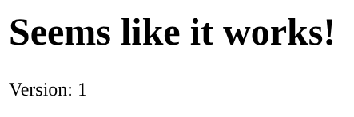
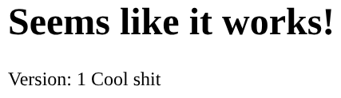

# Template System

The template system is a very helpful and awesome tool. Its purpose is to be able to use template strings like `{{version}}` in your frontend files and modify them before they are being served. For example, the code below would result in text being displayed as seen in the screenshot.

```html
<h1>Seems like it works!</h1>
Version: {{version}}
```



------

## Expanding templates

Templates like `{{version}}` can be easily added and in a very dynamic way. When using `starter.registerTemplateMiddleware()` you can define some specific parameters to extend certain parts, like these template strings called `placeholders`. You could return static arrays like in the example below or load templates from a database, its only important that the function will return an array like in this example at the end.

As you can see in the code, this template would be called `test`, and can be used like in the example below. By supplying `getPlaceholders` you wont overwrite the existing templates, which only consists of `version`, and instead these arrays will be merged.

```js
starter.registerTemplateMiddleware({
                                       getPlaceholders: async (req) => {
                                           return [
                                               ["test", () => "Cool shit"]
                                           ]
                                       }
                                   });
```

```html
<h1>Seems like it works!</h1>
Version: {{version}} {{test}}
```

