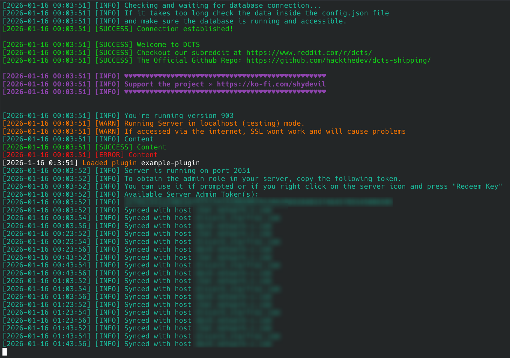
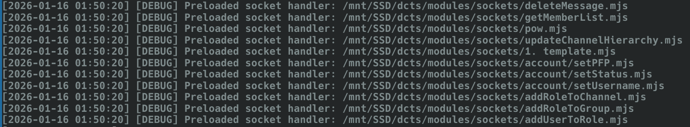
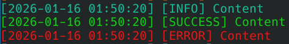

# Terminal Logger

This small library was designed for NodeJS and to bring pretty logs to the terminal. It has the following features:

- `Logger.info` prints in cyan
- `Logger.warn` prints in yellow
- `Logger.error` prints in red
- `Logger.success` prints in green
- `Logger.debug` will only print if `Logger.logDebug` is set to true and on default in a bright black color.
- `Logger.log` can be used to print custom "levels", which is whats shown in the `[ ]` brackets, like `INFO`, `SUCCESS` and more.
- `Logger.space` will print emty lines and supports a number argument to print multiple empty lines without spamming `Logger.space` lines or `console.log` and can be done with `Logger.space(2)` for two empty lines or more.





------

## Syntax examples

This is a general example

```js
Logger.info("Content")
Logger.success("Content")
Logger.error("Content")
```



### Printing objects

Objects will be printed using `JSON.stringify` 

```js
let obj = {
    name: "Marvin"
}

Logger.info(obj)
Logger.warn(obj)
Logger.error(obj)
Logger.success(obj)
```

### Custom colors and effects

You can print text with custom supported colors like in the following example. You can also use some special effects depending on your terminal like making text blink, underlined and more.

```js
Logger.info(`My awesome text`, Logger.colors.fgMagenta)
Logger.info(`My blinking text`, Logger.colors.blink)

// Alternative, theoretical multicolored words
Logger.info(`${Logger.colors.fgMagenta} My awesome text`)
Logger.info(`${Logger.colors.blink} My blinking text`)

```

```js
// Supported colors and effects 
static colors = {
    reset: "\x1b[0m",
    bright: "\x1b[1m",
    dim: "\x1b[2m",
    underscore: "\x1b[4m",
    blink: "\x1b[5m",
    reverse: "\x1b[7m",
    hidden: "\x1b[8m",

    fgBlack: "\x1b[30m",
    fgRed: "\x1b[31m",
    fgGreen: "\x1b[32m",
    fgYellow: "\x1b[33m",
    fgBlue: "\x1b[34m",
    fgMagenta: "\x1b[35m",
    fgCyan: "\x1b[36m",
    fgWhite: "\x1b[37m",
    fgGray: "\x1b[90m",

    bgBlack: "\x1b[40m",
    bgRed: "\x1b[41m",
    bgGreen: "\x1b[42m",
    bgYellow: "\x1b[43m",
    bgBlue: "\x1b[44m",
    bgMagenta: "\x1b[45m",
    bgCyan: "\x1b[46m",
    bgWhite: "\x1b[47m"
};
```

